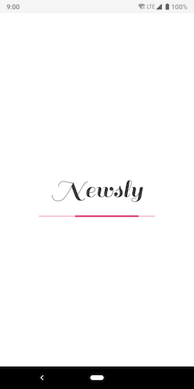
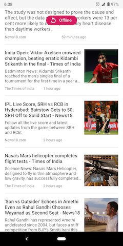

# Newsly

Newsly uses [newsapi.org](https://newsapi.org) to fetch news from your country. 
It shows a list of headlines, and clicking on one takes you to the news website.

Download signed apk [here](app/release/app-release.apk).





The app is built using **MVVM architecture** and RxJava2. Uses Room DAO for caching news items

Libraries used in this project -

- [Dagger 2](https://github.com/google/dagger)
- [Retrofit 2](https://square.github.io/retrofit/)
- [Glide](https://github.com/bumptech/glide)
- [ButterKnife](https://github.com/JakeWharton/butterknife)
- [RxJava2](https://github.com/ReactiveX/RxJava)
- [Room](https://developer.android.com/topic/libraries/architecture/room)

#### Build Instructions
Create [your own API key](https://newsapi.org/register) . Place your API key at 
```java
co.k2.newsbits.common.NewsApi.API_KEY
```
Build and run as usual 
